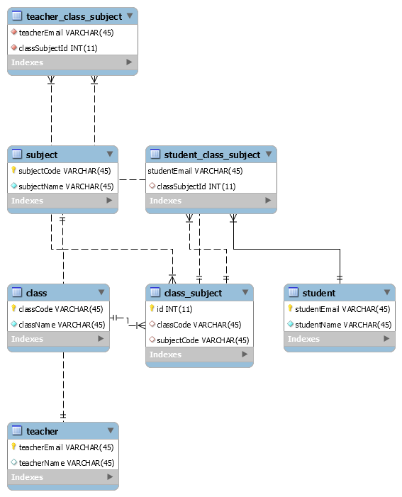

# Interview Assignment

### Database Design



### API

This package contains the answers  for the interview assignment.<br>
### Additional Libraries added
- sinon (for mocking repo calls when doing unit testing)
- lodash (some inbuilt utilities)
- joi + express-joi-validation (to validate request params)
<br>
<br>


## Prerequisites
- NodeJS v12.18.3
- Docker

<br>

## Package Structure
| S/N | Name | Type | Description |
|-----|------|------|-------------|
| 1 | external | dir | This holds the code for building external system which is required for question 2.<br><b>There is no need to modify anything inside or start it manually</b>
| 2 | javascript | dir | This holds the base code which you should extend in order to fulfil the requirements |
| 3 | README.md | file | This file |
| 4 | data.sample.csv | file | Sample csv for question 1 |
| 5 | school-administration-system.postman_collection.json | file | Postman script for uploading file |

<br>

## Exposed Port
| S/N | Application | Exposed Port |
|-----|-------------|--------------|
| 1 | database | 3306 |
| 2 | external | 5000 |
| 3 | applicaiton | 3000 |

<br>

## Commands
All the commands listed should be ran in ./javascript directory.

### Installing dependencies
```bash
npm install
```

<br>

### Starting Project
Starting the project in local environment.
This will start all the dependencies services i.e. database and external (folder).
```bash
npm start
```

<br>

### Running in watch mode
This will start the application in watch mode.
```bash
npm run start:dev
```

<br>

### Check local application is started
You should be able to call (GET) the following endpoint and get a 200 response

```
http://localhost:3000/api/healthcheck
```

<br>

### Check external system is started
You should be able to call (POST) the following endpoint and get a 200 response
```
  http://localhost:5000/students?class=2&offset=1&limit=2
```

<br>

## Extras

### Database
DDL added in javascript/database folder

<br>

## Design Assumptions

### Task 1
- When record is marked as toDelete 1 (the Teacher is no longer teaching this Student), there shouldnt be another record in same file where it marked as 0
- 1 class can be taught different teachers, provided they are all teaching different subject => if same subject is taught by different teachers in one class, latest recod will be counted

ex:- Teacher1 teaches physics for class 1
     Teacher2 teaches physics for class 1  (then, Teacher 2 will be acyually teaching physics to class 1)

### task 4
- teacher name is a unique value (so when listing teacher details by name there shouldnt be conflicts)
